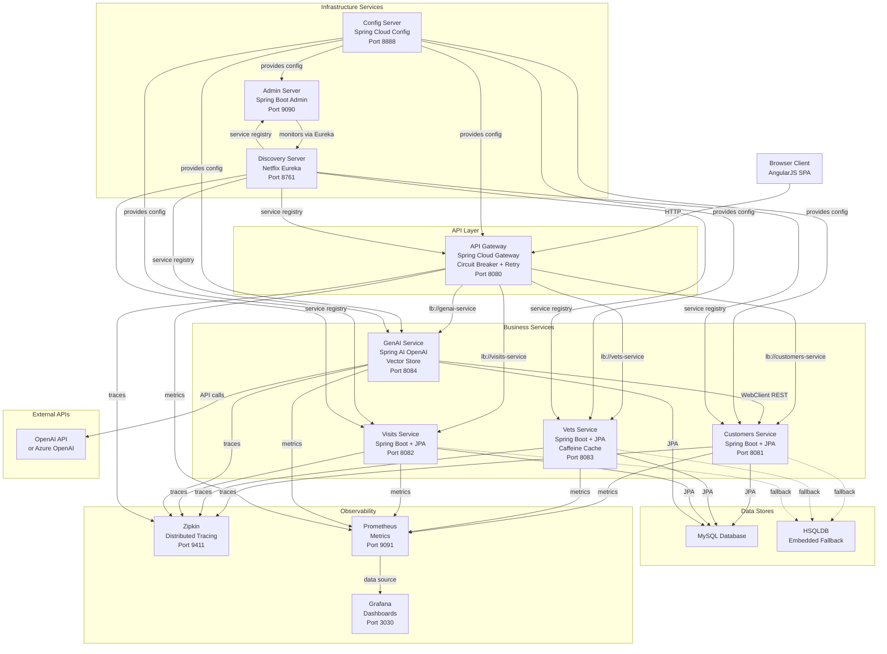

# Architecture Diagram

Spring PetClinic Microservices is a distributed application built on Spring Boot 3.4.1 and Spring Cloud 2024.0.0, consisting of eight services: five business microservices (API Gateway, Customers, Vets, Visits, GenAI), two infrastructure services (Config Server, Discovery Server), and one monitoring service (Admin Server).

## Application Architecture

