# Architecture Diagram

The Spring PetClinic Microservices application is a cloud-native system built with Spring Boot and Spring Cloud, consisting of multiple independent services coordinated through a centralized API gateway and service discovery.

## Application Architecture

```mermaid
flowchart TD
    User["User / Browser\nAngularJS 1.8.3 + Bootstrap"]

    subgraph Gateway["API Gateway (Port 8080)"]
        GW["Spring Cloud Gateway\nCircuit Breaker - Resilience4j\nLoad Balancing - Eureka"]
    end

    subgraph Infrastructure["Infrastructure Services"]
        CS["Config Server (Port 8888)\nSpring Cloud Config\nGit-backed configuration"]
        DS["Discovery Server (Port 8761)\nSpring Cloud Netflix Eureka\nService Registry"]
        AS["Admin Server (Port 9090)\nSpring Boot Admin\nMonitoring and Management"]
    end

    subgraph BusinessServices["Business Services"]
        CustSvc["Customers Service (Port 8081)\nSpring Boot 3 + Spring Data JPA\nManages owners and pets"]
        VetSvc["Vets Service (Port 8083)\nSpring Boot 3 + Spring Data JPA\nCaffeine Cache\nManages veterinarians"]
        VisitSvc["Visits Service (Port 8082)\nSpring Boot 3 + Spring Data JPA\nManages pet visits"]
        GenAI["GenAI Service (Port 8084)\nSpring AI + OpenAI GPT-4o-mini\nAzure OpenAI GPT-4o\nChatbot interface"]
    end

    subgraph DataLayer["Data Layer"]
        MySQL["MySQL 8\nProduction database\nCustomers, Vets, Visits"]
        HSQLDB["HSQLDB\nIn-memory database\nDevelopment and testing"]
        Cache["Caffeine Cache\nIn-memory caching\nVets data"]
    end

    subgraph Observability["Observability"]
        Zipkin["Zipkin (Port 9411)\nDistributed Tracing\nOpenTelemetry + Brave"]
        Prometheus["Prometheus (Port 9091)\nMetrics Collection\nMicrometer"]
        Grafana["Grafana (Port 3030)\nMetrics Dashboards"]
    end

    subgraph ExternalServices["External Services"]
        OpenAI["OpenAI API\nGPT-4o-mini"]
        AzureOAI["Azure OpenAI\nGPT-4o"]
        GitConfig["GitHub\nConfig Repository"]
    end

    User -->|HTTP REST| GW
    GW -->|"/api/customer/**"| CustSvc
    GW -->|"/api/vet/**"| VetSvc
    GW -->|"/api/visit/**"| VisitSvc
    GW -->|"/api/genai/**"| GenAI

    CS -->|Pulls config from| GitConfig
    CustSvc -->|Fetches config| CS
    VetSvc -->|Fetches config| CS
    VisitSvc -->|Fetches config| CS
    GenAI -->|Fetches config| CS
    GW -->|Fetches config| CS

    CustSvc -->|Registers and discovers| DS
    VetSvc -->|Registers and discovers| DS
    VisitSvc -->|Registers and discovers| DS
    GenAI -->|Registers and discovers| DS
    GW -->|Service discovery| DS

    CustSvc -->|Reads and writes| MySQL
    VetSvc -->|Reads and writes| MySQL
    VisitSvc -->|Reads and writes| MySQL
    VetSvc -->|Caches data| Cache
    CustSvc -.->|Dev mode| HSQLDB
    VetSvc -.->|Dev mode| HSQLDB
    VisitSvc -.->|Dev mode| HSQLDB

    GenAI -->|AI completions| OpenAI
    GenAI -->|AI completions| AzureOAI

    CustSvc -->|Traces| Zipkin
    VetSvc -->|Traces| Zipkin
    VisitSvc -->|Traces| Zipkin
    GenAI -->|Traces| Zipkin
    GW -->|Traces| Zipkin

    Prometheus -->|Scrapes metrics| CustSvc
    Prometheus -->|Scrapes metrics| VetSvc
    Prometheus -->|Scrapes metrics| VisitSvc
    Prometheus -->|Scrapes metrics| GenAI
    Grafana -->|Queries| Prometheus

    AS -->|Monitors| CustSvc
    AS -->|Monitors| VetSvc
    AS -->|Monitors| VisitSvc
    AS -->|Monitors| GenAI
```

