# Spring PetClinic Microservices - Component Relationship Diagram

## Overview

This document maps the internal component relationships across all microservices in the Spring PetClinic Microservices project. Components are organized by architectural layer within each service.

## Component Relationship Diagram

```mermaid
flowchart TD
    subgraph APIGateway["API Gateway (port 8080)"]
        direction TB
        subgraph AGPresentation["Presentation Layer"]
            AGController["ApiGatewayController\nRestController\nGET /api/gateway/owners/{id}"]
            FallbackCtrl["FallbackController\nRestController"]
        end
        subgraph AGApplication["Application Layer"]
            CustClient["CustomersServiceClient\nWebClient"]
            VisitClient["VisitsServiceClient\nWebClient"]
        end
        subgraph AGInfra["Infrastructure"]
            AGCB["ReactiveCircuitBreakerFactory\nResilience4j"]
        end
        AGController -->|uses| CustClient
        AGController -->|uses| VisitClient
        AGController -->|applies| AGCB
    end

    subgraph CustomersService["Customers Service (port 8081)"]
        direction TB
        subgraph CSPresentation["Presentation Layer"]
            OwnerResource["OwnerResource\nRestController\nCRUD /owners"]
            PetResource["PetResource\nRestController\nCRUD /owners/pets"]
        end
        subgraph CSModel["Data Layer"]
            OwnerRepo["OwnerRepository\nJpaRepository"]
            PetRepo["PetRepository\nJpaRepository"]
            OwnerEntity["Owner\nJPA Entity"]
            PetEntity["Pet\nJPA Entity"]
            PetTypeEntity["PetType\nJPA Entity"]
        end
        subgraph CSMapper["Mapper Layer"]
            OwnerMapper["OwnerEntityMapper"]
        end
        subgraph CSConfig["Config"]
            CSMetrics["MetricConfig\nMicrometer"]
        end
        OwnerResource -->|uses| OwnerRepo
        OwnerResource -->|uses| OwnerMapper
        PetResource -->|uses| PetRepo
        PetResource -->|uses| OwnerRepo
        OwnerRepo -->|manages| OwnerEntity
        PetRepo -->|manages| PetEntity
        PetRepo -->|manages| PetTypeEntity
    end

    subgraph VisitsService["Visits Service (port 8082)"]
        direction TB
        subgraph VSPresentation["Presentation Layer"]
            VisitResource["VisitResource\nRestController\nCRUD /owners/pets/{id}/visits\nGET /pets/visits"]
        end
        subgraph VSModel["Data Layer"]
            VisitRepo["VisitRepository\nJpaRepository"]
            VisitEntity["Visit\nJPA Entity"]
        end
        subgraph VSConfig["Config"]
            VSMetrics["MetricConfig\nMicrometer"]
        end
        VisitResource -->|uses| VisitRepo
        VisitRepo -->|manages| VisitEntity
    end

    subgraph VetsService["Vets Service (port 8083)"]
        direction TB
        subgraph VtPresentation["Presentation Layer"]
            VetResource["VetResource\nRestController\nGET /vets\nCacheable"]
        end
        subgraph VtModel["Data Layer"]
            VetRepo["VetRepository\nJpaRepository"]
            VetEntity["Vet\nJPA Entity"]
            SpecialtyEntity["Specialty\nJPA Entity"]
        end
        subgraph VtConfig["Config"]
            CacheConfig["CacheConfig\nCaffeine"]
            VetsProperties["VetsProperties\nConfigurationProperties"]
        end
        VetResource -->|uses| VetRepo
        VetResource -->|cached by| CacheConfig
        VetRepo -->|manages| VetEntity
        VetRepo -->|manages| SpecialtyEntity
    end

    subgraph GenAIService["GenAI Service (port 8084)"]
        direction TB
        subgraph GAPresentation["Presentation Layer"]
            ChatController["PetclinicChatClient\nRestController\nPOST /chatclient"]
        end
        subgraph GAApplication["Application Layer"]
            AIDataProvider["AIDataProvider\nService\nWebClient"]
            AIFunctionConfig["AIFunctionConfiguration\nBean Functions"]
            AIBeanConfig["AIBeanConfiguration\nChatClient, VectorStore"]
        end
        ChatController -->|uses| AIDataProvider
        ChatController -->|uses| AIFunctionConfig
        AIFunctionConfig -->|invokes| AIDataProvider
        AIBeanConfig -->|configures| ChatController
    end

    subgraph ConfigServer["Config Server (port 8888)"]
        ConfigApp["ConfigServerApplication\nEnableConfigServer"]
    end

    subgraph DiscoveryServer["Discovery Server (port 8761)"]
        DiscoveryApp["DiscoveryServerApplication\nEnableEurekaServer"]
    end

    subgraph AdminServer["Admin Server (port 9090)"]
        AdminApp["AdminServerApplication\nEnableAdminServer\nEnableDiscoveryClient"]
    end

    subgraph ExternalDeps["External / Infrastructure"]
        MySQL[(MySQL DB)]
        EurekaReg[("Eureka\nRegistry")]
        SpringConfig[("Spring Cloud\nConfig Server")]
        ZipkinSvr["Zipkin Tracing"]
        OpenAIAPI["OpenAI API"]
    end

    CustClient -->|"GET /owners/{id}"| OwnerResource
    VisitClient -->|"GET /pets/visits"| VisitResource
    AIDataProvider -->|"GET /owners, POST /owners"| OwnerResource
    AIDataProvider -->|"POST /owners/{id}/pets"| PetResource
    AIDataProvider -->|"similarity search"| VectorStore["VectorStore\nIn-Memory"]

    CustomersService -->|JPA| MySQL
    VisitsService -->|JPA| MySQL
    VetsService -->|JPA| MySQL
    GenAIService -->|JPA| MySQL

    APIGateway -->|fetches config| SpringConfig
    CustomersService -->|fetches config| SpringConfig
    VisitsService -->|fetches config| SpringConfig
    VetsService -->|fetches config| SpringConfig
    GenAIService -->|fetches config| SpringConfig
    AdminServer -->|fetches config| SpringConfig

    APIGateway -->|registers| EurekaReg
    CustomersService -->|registers| EurekaReg
    VisitsService -->|registers| EurekaReg
    VetsService -->|registers| EurekaReg
    GenAIService -->|registers| EurekaReg
    AdminServer -->|discovers| EurekaReg

    APIGateway -->|traces| ZipkinSvr
    CustomersService -->|traces| ZipkinSvr
    VisitsService -->|traces| ZipkinSvr
    VetsService -->|traces| ZipkinSvr

    ChatController -->|"LLM chat"| OpenAIAPI
```



## Component Details by Service

### API Gateway (`spring-petclinic-api-gateway`)

| Component | Type | Package | Responsibility |
|---|---|---|---|
| `ApiGatewayController` | `@RestController` | `boundary.web` | Orchestrates owner+visits data from downstream services |
| `FallbackController` | `@RestController` | `boundary.web` | Returns fallback response when circuit breaker triggers |
| `CustomersServiceClient` | `@Component` | `application` | WebClient-based HTTP client for Customers Service |
| `VisitsServiceClient` | `@Component` | `application` | WebClient-based HTTP client for Visits Service |
| `ReactiveCircuitBreakerFactory` | Spring Bean | — | Resilience4j circuit breaker applied to visits calls |
| DTOs | Records | `dto` | `OwnerDetails`, `PetDetails`, `VisitDetails`, `Visits`, `PetType` |

**Interaction Flow:**
```
ApiGatewayController
  → CustomersServiceClient  → [customers-service] GET /owners/{id}
  → VisitsServiceClient     → [visits-service]    GET /pets/visits
  → ReactiveCircuitBreaker  (fallback: empty visits)
```

---

### Customers Service (`spring-petclinic-customers-service`)

| Component | Type | Package | Responsibility |
|---|---|---|---|
| `OwnerResource` | `@RestController` | `web` | CRUD operations for pet owners (`/owners`) |
| `PetResource` | `@RestController` | `web` | CRUD operations for pets (`/owners/{id}/pets`, `/petTypes`) |
| `OwnerRepository` | `JpaRepository` | `model` | JPA access for `Owner` entities |
| `PetRepository` | `JpaRepository` | `model` | JPA access for `Pet` and `PetType` entities |
| `Owner` | `@Entity` | `model` | JPA entity for pet owner |
| `Pet` | `@Entity` | `model` | JPA entity for pet |
| `PetType` | `@Entity` | `model` | JPA entity for pet type |
| `OwnerEntityMapper` | Mapper | `web.mapper` | Maps `OwnerRequest` DTO to `Owner` entity |
| `MetricConfig` | `@Configuration` | `config` | Micrometer metrics configuration |
| DTOs | Records | `web` | `OwnerRequest`, `PetRequest`, `PetDetails` |

---

### Visits Service (`spring-petclinic-visits-service`)

| Component | Type | Package | Responsibility |
|---|---|---|---|
| `VisitResource` | `@RestController` | `web` | CRUD for visits (`/owners/*/pets/{id}/visits`, `/pets/visits`) |
| `VisitRepository` | `JpaRepository` | `model` | JPA access for `Visit` entities |
| `Visit` | `@Entity` | `model` | JPA entity for a vet visit |
| `MetricConfig` | `@Configuration` | `config` | Micrometer metrics configuration |

---

### Vets Service (`spring-petclinic-vets-service`)

| Component | Type | Package | Responsibility |
|---|---|---|---|
| `VetResource` | `@RestController` | `web` | Lists veterinarians (`GET /vets`) with Caffeine caching |
| `VetRepository` | `JpaRepository` | `model` | JPA access for `Vet` entities |
| `Vet` | `@Entity` | `model` | JPA entity for a veterinarian |
| `Specialty` | `@Entity` | `model` | JPA entity for vet specialty |
| `CacheConfig` | `@Configuration` | `system` | Configures Caffeine cache for vet list |
| `VetsProperties` | `@ConfigurationProperties` | `system` | Binds configuration properties for the service |

---

### GenAI Service (`spring-petclinic-genai-service`)

| Component | Type | Package | Responsibility |
|---|---|---|---|
| `PetclinicChatClient` | `@RestController` | root | REST endpoint (`POST /chatclient`) for AI chat |
| `AIDataProvider` | `@Service` | root | WebClient calls to Customers Service; Vector Store queries |
| `AIFunctionConfiguration` | `@Configuration` | root | Registers Spring AI tool functions (listOwners, addOwner, addPet, listVets) |
| `AIBeanConfiguration` | `@Configuration` | root | Configures `ChatClient`, `VectorStore`, and `ChatMemory` |
| DTOs | Records/Classes | `dto` | `OwnerDetails`, `PetDetails`, `VisitDetails`, `Vet`, `Specialty`, `PetRequest`, `PetType` |

**Interaction Flow:**
```
PetclinicChatClient (POST /chatclient)
  → ChatClient (Spring AI)
      → OpenAI API  (LLM inference)
      → AIFunctionConfiguration (tool calls dispatched by LLM)
          → AIDataProvider
              → [customers-service] GET /owners
              → [customers-service] POST /owners
              → [customers-service] POST /owners/{id}/pets
              → VectorStore (vet data similarity search)
```

---

### Infrastructure Services

| Service | Key Component | Technology |
|---|---|---|
| Config Server | `ConfigServerApplication` | `@EnableConfigServer` |
| Discovery Server | `DiscoveryServerApplication` | `@EnableEurekaServer` |
| Admin Server | `AdminServerApplication` | `@EnableAdminServer` + `@EnableDiscoveryClient` |

## Cross-Cutting Concerns

| Concern | Implementation | Applied To |
|---|---|---|
| Distributed Tracing | Micrometer Tracing + Brave + Zipkin | api-gateway, customers, visits, vets |
| Metrics | Micrometer + Prometheus | all business services |
| Service Discovery | Netflix Eureka (client) | api-gateway, customers, visits, vets, genai, admin |
| Centralized Config | Spring Cloud Config (client) | all services |
| Circuit Breaking | Resilience4j (reactive) | api-gateway, genai |
| Caching | Caffeine | vets (vet list), api-gateway |
| Chaos Engineering | Chaos Monkey | customers, visits, vets, genai |
| JMX over HTTP | Jolokia | all services |
| Validation | Jakarta Bean Validation | customers (`@Valid`), visits (`@Valid`, `@Min`) |
