# Spring PetClinic Microservices - Dependency Map

## Overview

This document maps all declared dependencies across the Spring PetClinic Microservices project, grouped by functional category. The project is a multi-module Maven project with a parent POM (`spring-petclinic-microservices:3.4.1`) that inherits from `spring-boot-starter-parent:3.4.1`.

## Dependency Map Diagram

```mermaid
flowchart TD
    App["spring-petclinic-microservices\nv3.4.1"]

    subgraph ParentBOM["Parent BOM"]
        SBParent["spring-boot-starter-parent\nv3.4.1"]
        SCDepMgmt["spring-cloud-dependencies BOM\nv2024.0.0"]
        SpringAIBOM["spring-ai-bom\nv1.0.0-M4\ngenai-service only"]
    end

    subgraph SpringBoot["Spring Boot Starters"]
        SBWeb["spring-boot-starter-web"]
        SBActuator["spring-boot-starter-actuator"]
        SBJPA["spring-boot-starter-data-jpa"]
        SBCache["spring-boot-starter-cache"]
        SBTest["spring-boot-starter-test"]
        SBDevtools["spring-boot-devtools\napi-gateway only"]
        SBConfigProc["spring-boot-configuration-processor\noptional"]
    end

    subgraph SpringCloud["Spring Cloud"]
        SCConfig["spring-cloud-starter-config\nall services"]
        SCEureka["spring-cloud-starter-netflix-eureka-client\nbusiness services"]
        SCEurekaServer["spring-cloud-starter-netflix-eureka-server\ndiscovery-server only"]
        SCConfigServer["spring-cloud-config-server\nconfig-server only"]
        SCGateway["spring-cloud-starter-gateway\napi-gateway, genai-service"]
        SCCB["spring-cloud-starter-circuitbreaker-reactor-resilience4j\napi-gateway, genai-service"]
    end

    subgraph SpringAI["Spring AI"]
        SAOpenAI["spring-ai-openai-spring-boot-starter\ngenai-service only"]
    end

    subgraph SpringBootAdmin["Spring Boot Admin"]
        SBAServer["spring-boot-admin-starter-server\nv3.4.1\nadmin-server only"]
        SBAUI["spring-boot-admin-server-ui\nv3.4.1\nadmin-server only"]
    end

    subgraph Database["Database"]
        MySQL["mysql-connector-j\nruntime\ncustomers, visits, vets, genai"]
        HSQLDB["hsqldb\nruntime\ncustomers, visits, vets, genai"]
    end

    subgraph Observability["Observability and Tracing"]
        MicrometerPrometheus["micrometer-registry-prometheus\nbusiness services"]
        MicrometerObs["micrometer-observation\nbusiness services"]
        MicrometerTracing["micrometer-tracing-bridge-brave\nbusiness services"]
        OtelZipkin["opentelemetry-exporter-zipkin\nbusiness services"]
        ZipkinReporter["zipkin-reporter-brave\nbusiness services"]
        DSMicrometer["datasource-micrometer-spring-boot\nv1.0.2\ncustomers, visits, vets"]
        Resilience4jMicrometer["resilience4j-micrometer\napi-gateway only"]
    end

    subgraph Caching["Caching"]
        Caffeine["caffeine\nvets, api-gateway, genai, admin"]
        JCacheAPI["cache-api javax.cache\nvets, genai"]
    end

    subgraph Utilities["Utilities"]
        Jolokia["jolokia-core\nv1.7.1\nall services"]
        JakartaXMLBind["jakarta.xml.bind-api\nvets, genai"]
        JAXBRuntime["jaxb-runtime\ndiscovery-server only"]
        ChaosMonkey["chaos-monkey-spring-boot\nv3.1.0\ncustomers, visits, vets, genai"]
    end

    subgraph WebJars["WebJars (api-gateway only)"]
        AngularJS["angularjs\nv1.8.3"]
        Bootstrap["bootstrap\nv5.3.3"]
        FontAwesome["font-awesome\nv4.7.0"]
        AngularUIRouter["angular-ui-router\nv1.0.30"]
        WebjarsLocator["webjars-locator-core"]
        Marked["marked\nv14.1.2"]
    end

    subgraph Testing["Testing"]
        JUnitAPI["junit-jupiter-api"]
        JUnitEngine["junit-jupiter-engine"]
        AssertJ["assertj-core"]
        MockWebServer["mockwebserver\nv4.12.0\napi-gateway tests only"]
    end

    App --> SBParent
    App --> SCDepMgmt
    App --> SpringAIBOM

    App --> SBWeb
    App --> SBActuator
    App --> SBJPA
    App --> SBCache
    App --> SBTest
    App --> SBDevtools
    App --> SBConfigProc

    App --> SCConfig
    App --> SCEureka
    App --> SCEurekaServer
    App --> SCConfigServer
    App --> SCGateway
    App --> SCCB

    App --> SAOpenAI

    App --> SBAServer
    App --> SBAUI

    App --> MySQL
    App --> HSQLDB

    App --> MicrometerPrometheus
    App --> MicrometerObs
    App --> MicrometerTracing
    App --> OtelZipkin
    App --> ZipkinReporter
    App --> DSMicrometer
    App --> Resilience4jMicrometer

    App --> Caffeine
    App --> JCacheAPI

    App --> Jolokia
    App --> JakartaXMLBind
    App --> JAXBRuntime
    App --> ChaosMonkey

    App --> AngularJS
    App --> Bootstrap
    App --> FontAwesome
    App --> AngularUIRouter
    App --> WebjarsLocator
    App --> Marked

    App --> JUnitAPI
    App --> JUnitEngine
    App --> AssertJ
    App --> MockWebServer
```

## Dependency Details by Category

### Parent BOM / Dependency Management

| Artifact | Version | Scope | Used By |
|---|---|---|---|
| `spring-boot-starter-parent` | 3.4.1 | BOM | All modules |
| `spring-cloud-dependencies` | 2024.0.0 | BOM import | All modules |
| `spring-ai-bom` | 1.0.0-M4 | BOM import | genai-service |

### Spring Boot Starters

| Artifact | Version | Scope | Used By |
|---|---|---|---|
| `spring-boot-starter-web` | managed | compile | api-gateway, customers, visits, vets, genai |
| `spring-boot-starter-actuator` | managed | compile | api-gateway, customers, visits, vets, genai, admin |
| `spring-boot-starter-data-jpa` | managed | compile | customers, visits, vets, genai |
| `spring-boot-starter-cache` | managed | compile | api-gateway, vets, genai, admin |
| `spring-boot-starter-test` | managed | test | all modules |
| `spring-boot-devtools` | managed | optional | api-gateway |
| `spring-boot-configuration-processor` | managed | optional | api-gateway, vets, genai |

### Spring Cloud

| Artifact | Version | Scope | Used By |
|---|---|---|---|
| `spring-cloud-starter-config` | managed | compile | all services |
| `spring-cloud-starter-netflix-eureka-client` | managed | compile | api-gateway, customers, visits, vets, genai, admin |
| `spring-cloud-starter-netflix-eureka-server` | managed | compile | discovery-server |
| `spring-cloud-config-server` | managed | compile | config-server |
| `spring-cloud-starter-gateway` | managed | compile | api-gateway, genai |
| `spring-cloud-starter-circuitbreaker-reactor-resilience4j` | managed | compile | api-gateway, genai |

### Spring AI

| Artifact | Version | Scope | Used By |
|---|---|---|---|
| `spring-ai-openai-spring-boot-starter` | 1.0.0-M4 | compile | genai-service |

### Spring Boot Admin

| Artifact | Version | Scope | Used By |
|---|---|---|---|
| `spring-boot-admin-starter-server` | 3.4.1 | compile | admin-server |
| `spring-boot-admin-server-ui` | 3.4.1 | compile | admin-server |

### Database

| Artifact | Version | Scope | Used By |
|---|---|---|---|
| `mysql-connector-j` | managed | runtime | customers, visits, vets, genai |
| `hsqldb` | managed | runtime | customers, visits, vets, genai |

### Observability and Tracing

| Artifact | Version | Scope | Used By |
|---|---|---|---|
| `micrometer-registry-prometheus` | managed | compile | customers, visits, vets, genai, api-gateway |
| `micrometer-observation` | managed | compile | customers, visits, vets, api-gateway |
| `micrometer-tracing-bridge-brave` | managed | compile | customers, visits, vets, api-gateway |
| `opentelemetry-exporter-zipkin` | managed | compile | customers, visits, vets, api-gateway, genai |
| `zipkin-reporter-brave` | managed | compile | customers, visits, vets, api-gateway |
| `datasource-micrometer-spring-boot` | 1.0.2 | compile | customers, visits, vets |
| `resilience4j-micrometer` | managed | compile | api-gateway |

### Caching

| Artifact | Version | Scope | Used By |
|---|---|---|---|
| `caffeine` | managed | compile | api-gateway, vets, genai, admin |
| `cache-api` (javax.cache) | managed | compile | vets, genai |

### Utilities

| Artifact | Version | Scope | Used By |
|---|---|---|---|
| `jolokia-core` | 1.7.1 | compile | all services |
| `jakarta.xml.bind-api` | managed | compile | vets, genai |
| `jaxb-runtime` | managed | compile | discovery-server |
| `chaos-monkey-spring-boot` | 3.1.0 | compile | customers, visits, vets, genai |

### WebJars (api-gateway only)

| Artifact | Version | Scope |
|---|---|---|
| `angularjs` | 1.8.3 | compile |
| `bootstrap` | 5.3.3 | compile |
| `font-awesome` | 4.7.0 | compile |
| `angular-ui-router` | 1.0.30 | compile |
| `webjars-locator-core` | managed | compile |
| `marked` | 14.1.2 | compile |

### Testing

| Artifact | Version | Scope | Used By |
|---|---|---|---|
| `junit-jupiter-api` | managed | test | all modules |
| `junit-jupiter-engine` | managed | test | all modules |
| `assertj-core` | managed | test | customers |
| `mockwebserver` | 4.12.0 | test | api-gateway |

## Notes

- All Spring Boot and Spring Cloud versions are managed through the parent BOM unless specified explicitly.
- Spring AI (`1.0.0-M4`) is a milestone release — consider upgrading to a stable GA release.
- `jolokia-core` is pinned at version `1.7.1` — consider evaluating Jolokia 2.x for Java 17+ compatibility.
- `datasource-micrometer-spring-boot` is pinned at version `1.0.2` — not managed by the Spring Boot BOM.
- `chaos-monkey-spring-boot` version `3.1.0` is declared in the parent BOM's `dependencyManagement`.
