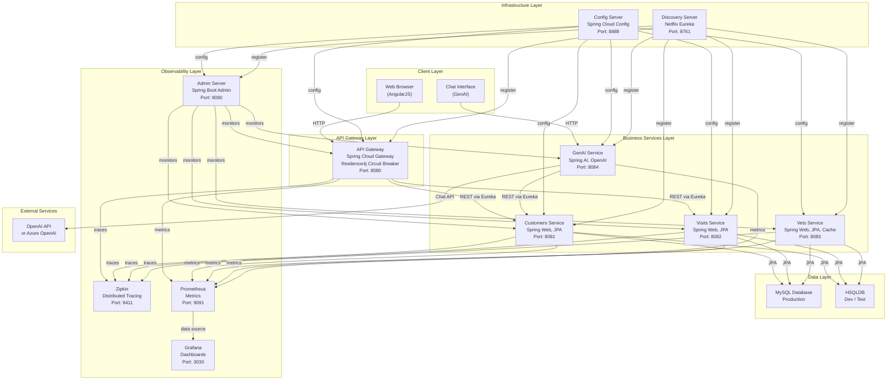

# Spring PetClinic Microservices - Architecture Diagram

## Overview

This document presents the high-level architecture of the Spring PetClinic Microservices application — a Spring Boot 3.4.1 / Spring Cloud 2024.0.0 based system composed of 8 microservices.

## Architecture Diagram

## Architecture Description

### Client Layer
- **Web Browser**: Single-page application built with AngularJS, Bootstrap, and Font Awesome — served directly by the API Gateway
- **Chat Interface**: AI-powered chat UI that communicates with the GenAI Service

### Infrastructure Layer
- **Config Server** (port 8888): Centralized configuration management using Spring Cloud Config. All microservices retrieve their configuration from this server on startup.
- **Discovery Server** (port 8761): Netflix Eureka service registry. All business services register themselves and discover each other through this server.

### API Gateway Layer
- **API Gateway** (port 8080): Single entry point for all client requests. Uses Spring Cloud Gateway for routing, serves the AngularJS frontend, and applies a Resilience4j circuit breaker for resilient upstream calls.

### Business Services Layer
| Service | Port | Key Technology |
|---|---|---|
| Customers Service | 8081 | Spring Web, Spring Data JPA, Micrometer |
| Visits Service | 8082 | Spring Web, Spring Data JPA, Micrometer |
| Vets Service | 8083 | Spring Web, Spring Data JPA, Caffeine Cache |
| GenAI Service | 8084 | Spring AI, OpenAI / Azure OpenAI, Vector Store |

### Data Layer
- **MySQL**: Production-grade relational database used by Customers, Visits, and Vets services
- **HSQLDB**: Embedded in-memory database used for local development and testing

### Observability Layer
| Component | Port | Purpose |
|---|---|---|
| Admin Server | 9090 | Spring Boot Admin — service health and management |
| Zipkin | 9411 | Distributed tracing (OpenTelemetry + Brave bridge) |
| Prometheus | 9091 | Metrics collection (Micrometer) |
| Grafana | 3030 | Metrics dashboards |

### External Services
- **OpenAI / Azure OpenAI**: Used by the GenAI Service for the AI chat assistant functionality. Configured via environment variables (`OPENAI_API_KEY` or `AZURE_OPENAI_KEY` / `AZURE_OPENAI_ENDPOINT`).

## Technology Stack Summary

| Category | Technology | Version |
|---|---|---|
| Language | Java | 17 |
| Framework | Spring Boot | 3.4.1 |
| Cloud | Spring Cloud | 2024.0.0 |
| Service Discovery | Netflix Eureka | via Spring Cloud |
| API Gateway | Spring Cloud Gateway | via Spring Cloud |
| Circuit Breaker | Resilience4j | via Spring Cloud |
| Config Management | Spring Cloud Config | via Spring Cloud |
| Data Access | Spring Data JPA / Hibernate | via Spring Boot |
| Database (prod) | MySQL | latest |
| Database (dev) | HSQLDB | via Spring Boot |
| Caching | Caffeine | via Spring Boot |
| Tracing | OpenTelemetry + Zipkin + Brave | via Micrometer |
| Metrics | Micrometer + Prometheus | via Spring Boot |
| Monitoring | Spring Boot Admin | 3.4.1 |
| AI | Spring AI (OpenAI) | 1.0.0-M4 |
| Build | Maven | 3.x |
| Containerization | Docker / Docker Compose | — |
