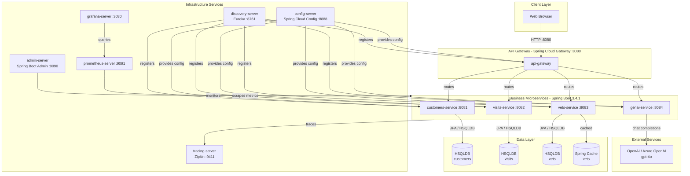
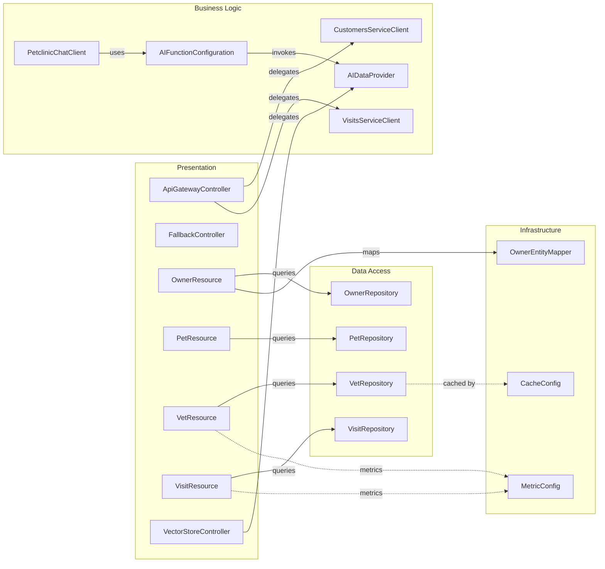

# Architecture Diagram

Spring PetClinic Microservices is a Spring Boot 3.4.1 application composed of independent services coordinated by Spring Cloud components for service discovery, centralized configuration, and an API gateway.

## Application Architecture

## Component Relationships

