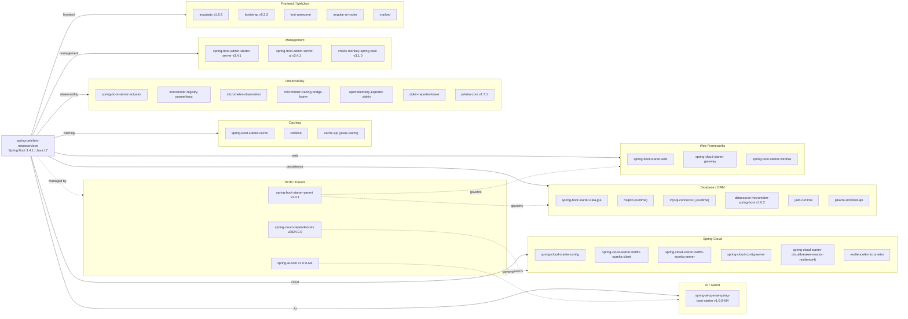

# Dependency Map

Spring PetClinic Microservices declares approximately 30 unique external dependencies across its 8 Maven modules, managed via Spring Boot 3.4.1 parent BOM and Spring Cloud 2024.0.0 BOM.

## Dependencies

