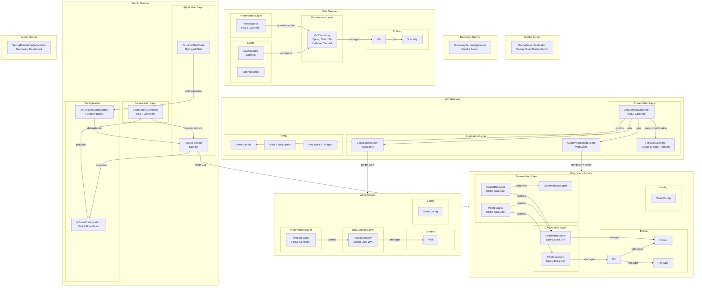

# Component Relationship Diagram

This diagram shows the internal component structure and interactions across all microservices in the Spring PetClinic application.

## Component Relationships

```mermaid
flowchart TB
    subgraph ConfigServer["Config Server"]
        ConfigApp["ConfigServerApplication\nSpring Cloud Config Server"]
    end

    subgraph DiscoveryServer["Discovery Server"]
        DiscoveryApp["DiscoveryServerApplication\nEureka Server"]
    end

    subgraph APIGateway["API Gateway"]
        subgraph GatewayPresentation["Presentation Layer"]
            ApiGatewayController["ApiGatewayController\nREST Controller"]
            FallbackController["FallbackController\nCircuit Breaker Fallback"]
        end
        subgraph GatewayApplication["Application Layer"]
            CustomersServiceClient["CustomersServiceClient\nWebClient"]
            VisitsServiceClient["VisitsServiceClient\nWebClient"]
        end
        subgraph GatewayDTO["DTOs"]
            OwnerDetailsDTO["OwnerDetails"]
            VisitsDTO["Visits / VisitDetails"]
            PetDetailsDTO["PetDetails / PetType"]
        end
    end

    subgraph CustomersService["Customers Service"]
        subgraph CustomersPresentation["Presentation Layer"]
            OwnerResource["OwnerResource\nREST Controller"]
            PetResource["PetResource\nREST Controller"]
            OwnerEntityMapper["OwnerEntityMapper"]
        end
        subgraph CustomersModel["Data Access Layer"]
            OwnerRepository["OwnerRepository\nSpring Data JPA"]
            PetRepository["PetRepository\nSpring Data JPA"]
        end
        subgraph CustomersEntities["Entities"]
            OwnerEntity["Owner"]
            PetEntity["Pet"]
            PetTypeEntity["PetType"]
        end
        subgraph CustomersConfig["Config"]
            CustomersMetricConfig["MetricConfig"]
        end
    end

    subgraph VetsService["Vets Service"]
        subgraph VetsPresentation["Presentation Layer"]
            VetResource["VetResource\nREST Controller"]
        end
        subgraph VetsModel["Data Access Layer"]
            VetRepository["VetRepository\nSpring Data JPA\nCaffeine Cached"]
        end
        subgraph VetsEntities["Entities"]
            VetEntity["Vet"]
            SpecialtyEntity["Specialty"]
        end
        subgraph VetsConfig["Config"]
            CacheConfig["CacheConfig\nCaffeine"]
            VetsProperties["VetsProperties"]
        end
    end

    subgraph VisitsService["Visits Service"]
        subgraph VisitsPresentation["Presentation Layer"]
            VisitResource["VisitResource\nREST Controller"]
        end
        subgraph VisitsModel["Data Access Layer"]
            VisitRepository["VisitRepository\nSpring Data JPA"]
        end
        subgraph VisitsEntities["Entities"]
            VisitEntity["Visit"]
        end
        subgraph VisitsConfig["Config"]
            VisitsMetricConfig["MetricConfig"]
        end
    end

    subgraph GenAIService["GenAI Service"]
        subgraph GenAIPresentation["Presentation Layer"]
            VectorStoreController["VectorStoreController\nREST Controller"]
        end
        subgraph GenAIApplication["Application Layer"]
            PetclinicChatClient["PetclinicChatClient\nSpring AI Chat"]
            AIDataProvider["AIDataProvider\nService"]
        end
        subgraph GenAIConfig["Configuration"]
            AIFunctionConfig["AIFunctionConfiguration\nFunction Beans"]
            AIBeanConfig["AIBeanConfiguration\nVectorStore Bean"]
        end
    end

    subgraph AdminServer["Admin Server"]
        AdminApp["SpringBootAdminApplication\nMonitoring Dashboard"]
    end

    ApiGatewayController -->|uses| CustomersServiceClient
    ApiGatewayController -->|uses| VisitsServiceClient
    ApiGatewayController -->|returns| OwnerDetailsDTO
    ApiGatewayController -->|uses circuit breaker| FallbackController

    OwnerResource -->|queries| OwnerRepository
    OwnerResource -->|maps via| OwnerEntityMapper
    PetResource -->|queries| PetRepository
    PetResource -->|queries| OwnerRepository
    OwnerRepository -->|manages| OwnerEntity
    PetRepository -->|manages| PetEntity
    PetEntity -->|belongs to| OwnerEntity
    PetEntity -->|has type| PetTypeEntity

    VetResource -->|queries cached| VetRepository
    VetRepository -->|manages| VetEntity
    VetEntity -->|has| SpecialtyEntity
    CacheConfig -->|configures| VetRepository

    VisitResource -->|queries| VisitRepository
    VisitRepository -->|manages| VisitEntity

    VectorStoreController -->|ingests vets via| AIDataProvider
    PetclinicChatClient -->|calls functions| AIFunctionConfig
    AIFunctionConfig -->|delegates to| AIDataProvider
    AIDataProvider -->|REST call| CustomersService
    AIDataProvider -->|searches| AIBeanConfig
    AIBeanConfig -->|provides| VectorStoreController

    CustomersServiceClient -->|HTTP GET POST| CustomersService
    VisitsServiceClient -->|HTTP GET| VisitsService
```
