# Component Relationship Diagram

The Spring PetClinic Microservices application is composed of eight services, each following a layered architecture with controllers, services, repositories, and entities. The API Gateway aggregates responses from multiple backend services, while the GenAI service orchestrates AI-powered interactions using function calling and vector search.

## Component Relationships

```mermaid
flowchart TD
    User["User / Browser"]

    subgraph APIGateway["API Gateway Service"]
        GWApp["ApiGatewayApplication\nSpring Boot + Eureka Client"]
        GWController["ApiGatewayController\nREST: GET /api/gateway/owners/{id}"]
        FallbackCtrl["FallbackController\nREST: POST /fallback"]
        CustClient["CustomersServiceClient\nWebClient - lb://customers-service"]
        VisitClient["VisitsServiceClient\nWebClient - lb://visits-service"]
        GWDTOs["DTOs: OwnerDetails, PetDetails\nVisitDetails, Visits, PetType"]
        CBFactory["ReactiveCircuitBreakerFactory\nResilience4j circuit breaker"]
    end

    subgraph CustomersService["Customers Service"]
        CustApp["CustomersServiceApplication\nSpring Boot + Eureka Client"]
        OwnerResource["OwnerResource\nREST: POST/GET/PUT /owners"]
        PetResource["PetResource\nREST: GET /petTypes\nPOST/PUT/GET /owners/{id}/pets"]
        OwnerEntity["Owner\nJPA Entity"]
        PetEntity["Pet\nJPA Entity"]
        PetTypeEntity["PetType\nJPA Entity"]
        OwnerRepo["OwnerRepository\nJpaRepository"]
        PetRepo["PetRepository\nJpaRepository"]
        OwnerMapper["OwnerEntityMapper\nRequest to Entity mapper"]
        CustDTOs["DTOs: OwnerRequest, PetRequest\nPetDetails"]
    end

    subgraph VetsService["Vets Service"]
        VetsApp["VetsServiceApplication\nSpring Boot + Eureka Client"]
        VetResource["VetResource\nREST: GET /vets\nCacheable - vets"]
        VetEntity["Vet\nJPA Entity"]
        SpecialtyEntity["Specialty\nJPA Entity"]
        VetRepo["VetRepository\nJpaRepository"]
        CacheConf["CacheConfig\nEnableCaching - production"]
    end

    subgraph VisitsService["Visits Service"]
        VisitsApp["VisitsServiceApplication\nSpring Boot + Eureka Client"]
        VisitResource["VisitResource\nREST: POST/GET /owners/*/pets/{id}/visits\nGET /pets/visits"]
        VisitEntity["Visit\nJPA Entity"]
        VisitRepo["VisitRepository\nJpaRepository"]
    end

    subgraph GenAIService["GenAI Service"]
        GenAIApp["GenAIServiceApplication\nSpring Boot + Eureka Client"]
        ChatClientCtrl["PetclinicChatClient\nREST: POST /chatclient"]
        VectorStoreCtrl["VectorStoreController\nLoads vet data on startup"]
        AIDataProvider["AIDataProvider\nProvides data to AI functions\ngetAllOwners, getVets\naddOwnerToPetclinic, addPetToOwner"]
        AIBeanConf["AIBeanConfiguration\nChatMemory, VectorStore\nLoadBalanced WebClient"]
        AIFuncConf["AIFunctionConfiguration\nlistOwners, listVets\naddOwnerToPetclinic, addPetToOwner"]
        GenAIDTOs["DTOs: OwnerDetails, Vet\nOwnerRequest, PetRequest\nPetDetails, Specialty"]
    end

    subgraph InfraServices["Infrastructure Services"]
        ConfigSrv["ConfigServerApplication\nSpring Cloud Config Server\nGit-backed configuration"]
        DiscoverySrv["DiscoveryServerApplication\nNetflix Eureka Server\nService registry"]
        AdminSrv["SpringBootAdminApplication\nSpring Boot Admin\nMonitoring and management"]
    end

    subgraph DataStores["Data Stores"]
        CustDB["MySQL - Customers DB\nowners, pets, pet_types"]
        VetsDB["MySQL - Vets DB\nvets, specialties"]
        VisitsDB["MySQL - Visits DB\nvisits"]
        VetCache["Caffeine Cache\nvets cache"]
        VectorStore["In-Memory Vector Store\nVet data embeddings"]
    end

    subgraph ExternalAI["External AI Services"]
        OpenAI["OpenAI API\nGPT-4o-mini"]
        AzureOAI["Azure OpenAI\nGPT-4o"]
    end

    User -->|HTTP| GWController
    GWController --> CustClient
    GWController --> VisitClient
    GWController --> CBFactory
    GWController --> GWDTOs
    CustClient -->|HTTP GET /owners| OwnerResource
    VisitClient -->|HTTP GET /pets/visits| VisitResource
    FallbackCtrl -.->|Circuit breaker fallback| GWController

    OwnerResource --> OwnerRepo
    OwnerResource --> PetRepo
    OwnerResource --> OwnerMapper
    OwnerResource --> CustDTOs
    PetResource --> PetRepo
    PetResource --> CustDTOs
    OwnerMapper --> OwnerEntity
    OwnerRepo --> OwnerEntity
    PetRepo --> PetEntity
    PetRepo --> PetTypeEntity
    OwnerEntity --> PetEntity
    OwnerRepo -->|JPA| CustDB
    PetRepo -->|JPA| CustDB

    VetResource --> VetRepo
    VetResource --> CacheConf
    VetRepo --> VetEntity
    VetEntity --> SpecialtyEntity
    VetRepo -->|JPA| VetsDB
    CacheConf -->|Caches results| VetCache

    VisitResource --> VisitRepo
    VisitRepo --> VisitEntity
    VisitRepo -->|JPA| VisitsDB

    ChatClientCtrl --> AIDataProvider
    ChatClientCtrl --> AIFuncConf
    ChatClientCtrl --> AIBeanConf
    ChatClientCtrl -->|AI completions| OpenAI
    ChatClientCtrl -->|AI completions| AzureOAI
    VectorStoreCtrl -->|HTTP GET /vets| VetResource
    VectorStoreCtrl -->|Stores embeddings| VectorStore
    AIDataProvider -->|HTTP GET /owners| OwnerResource
    AIDataProvider -->|HTTP POST /owners| OwnerResource
    AIDataProvider -->|HTTP GET /vets| VetResource
    AIDataProvider -->|HTTP POST /pets| PetResource
    AIFuncConf --> AIDataProvider
    AIBeanConf --> VectorStore

    GWApp -->|Registers with| DiscoverySrv
    CustApp -->|Registers with| DiscoverySrv
    VetsApp -->|Registers with| DiscoverySrv
    VisitsApp -->|Registers with| DiscoverySrv
    GenAIApp -->|Registers with| DiscoverySrv

    GWApp -->|Fetches config| ConfigSrv
    CustApp -->|Fetches config| ConfigSrv
    VetsApp -->|Fetches config| ConfigSrv
    VisitsApp -->|Fetches config| ConfigSrv
    GenAIApp -->|Fetches config| ConfigSrv

    AdminSrv -->|Monitors all| GWApp
    AdminSrv -->|Monitors all| CustApp
    AdminSrv -->|Monitors all| VetsApp
    AdminSrv -->|Monitors all| VisitsApp
    AdminSrv -->|Monitors all| GenAIApp
```

