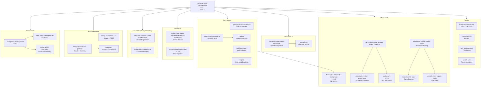

# Dependency Map

This diagram visualizes the declared dependencies of the Spring PetClinic Microservices project, grouped by functional category.

## Application Dependencies

```mermaid
flowchart TB
    App["spring-petclinic-microservices\nv3.4.1\nJava 17"]

    subgraph ParentBOM["Parent BOM"]
        SpringBootParent["spring-boot-starter-parent\nv3.4.1"]
        SpringCloudBOM["spring-cloud-dependencies\nv2024.0.0"]
        SpringAIBOM["spring-ai-bom\nv1.0.0-M4\nGenAI Service only"]
    end

    subgraph WebFramework["Web Framework"]
        SpringWeb["spring-boot-starter-web\nServlet + REST"]
        SpringGateway["spring-cloud-starter-gateway\nReactive Gateway"]
        SpringWebflux["WebClient\nReactive HTTP Client"]
    end

    subgraph ServiceDiscovery["Service Discovery and Config"]
        EurekaClient["spring-cloud-starter-netflix-eureka-client\nService Registration"]
        ConfigClient["spring-cloud-starter-config\nCentralized Config"]
    end

    subgraph Resilience["Resilience"]
        CircuitBreaker["spring-cloud-starter-circuitbreaker-reactor-resilience4j\nCircuit Breaker"]
        ChaosMonkey["chaos-monkey-spring-boot\nv3.1.0\nFault Injection"]
    end

    subgraph DataAccess["Data Access"]
        SpringDataJPA["spring-boot-starter-data-jpa\nHibernate ORM"]
        MySQLConnector["mysql-connector-j\nMySQL Driver"]
        HSQLDB["hsqldb\nEmbedded Database"]
        SpringCache["spring-boot-starter-cache\nCaffeine Cache"]
        Caffeine["caffeine\nIn-Memory Cache"]
    end

    subgraph AI["Generative AI"]
        SpringAIOpenAI["spring-ai-openai-spring-boot-starter\nOpenAI Integration"]
        VectorStore["VectorStore\nSimilarity Search"]
    end

    subgraph Observability["Observability"]
        Actuator["spring-boot-starter-actuator\nHealth + Metrics"]
        MicrometerPrometheus["micrometer-registry-prometheus\nPrometheus Metrics"]
        MicrometerTracing["micrometer-tracing-bridge-brave\nDistributed Tracing"]
        ZipkinReporter["zipkin-reporter-brave\nZipkin Exporter"]
        OpenTelemetry["opentelemetry-exporter-zipkin\nOTel Zipkin"]
        DatasourceMicrometer["datasource-micrometer-spring-boot\nv1.0.2\nDB Metrics"]
        Jolokia["jolokia-core\nv1.7.1\nJMX over HTTP"]
    end

    subgraph Testing["Testing"]
        SpringTest["spring-boot-starter-test\nJUnit 5 + Mockito"]
        JUnitAPI["junit-jupiter-api\nTest API"]
        JUnitEngine["junit-jupiter-engine\nTest Engine"]
        AssertJ["assertj-core\nFluent Assertions"]
    end

    App --> ParentBOM
    App --> WebFramework
    App --> ServiceDiscovery
    App --> Resilience
    App --> DataAccess
    App --> AI
    App --> Observability
    App --> Testing

    SpringBootParent --> SpringCloudBOM
    SpringBootParent --> SpringAIBOM

    SpringGateway --> SpringWebflux
    SpringCache --> Caffeine
    SpringAIOpenAI --> VectorStore
    MicrometerTracing --> ZipkinReporter
    MicrometerTracing --> OpenTelemetry
    Actuator --> MicrometerPrometheus
    Actuator --> Jolokia
    DataAccess --> DatasourceMicrometer
```
