# Dependency Map

The Spring PetClinic Microservices project is built on Spring Boot 3.4.1 and Spring Cloud 2024.0.0, with dependencies organized across cloud infrastructure, data access, observability, and AI integration categories.

## Application Dependency Map

```mermaid
flowchart TD
    APP["Spring PetClinic Microservices\nJava 17 | Spring Boot 3.4.1"]

    subgraph BOM["Bill of Materials"]
        SBParent["spring-boot-starter-parent\nv3.4.1"]
        SCDepMgmt["spring-cloud-dependencies\nv2024.0.0"]
        AIBom["spring-ai-bom\nv1.0.0-M4"]
    end

    subgraph CloudInfra["Spring Cloud Infrastructure"]
        ConfigClient["spring-cloud-starter-config\nCentralized configuration"]
        EurekaClient["spring-cloud-starter-netflix-eureka-client\nService discovery client"]
        EurekaServer["spring-cloud-starter-netflix-eureka-server\nService registry"]
        Gateway["spring-cloud-starter-gateway\nAPI routing and load balancing"]
        CircuitBreaker["spring-cloud-starter-circuitbreaker-reactor-resilience4j\nFault tolerance"]
    end

    subgraph WebREST["Web and REST"]
        WebStarter["spring-boot-starter-web\nREST API support"]
        Actuator["spring-boot-starter-actuator\nHealth and management"]
        Resilience4jMetrics["resilience4j-micrometer\nResilience metrics"]
    end

    subgraph DataDB["Data and Database"]
        DataJPA["spring-boot-starter-data-jpa\nORM with Hibernate"]
        MySQL["mysql-connector-j\nMySQL 8 driver - runtime"]
        HSQLDB["hsqldb\nIn-memory DB - runtime dev"]
    end

    subgraph Caching["Caching"]
        CacheStarter["spring-boot-starter-cache\nSpring caching abstraction"]
        Caffeine["caffeine\nIn-memory cache implementation"]
        CacheAPI["javax.cache:cache-api\nJSR-107 cache standard"]
    end

    subgraph Observability["Observability and Tracing"]
        Prometheus["micrometer-registry-prometheus\nPrometheus metrics export"]
        MicrometerObs["micrometer-observation\nObservability API"]
        TracingBrave["micrometer-tracing-bridge-brave\nBrave tracing bridge"]
        ZipkinExporter["opentelemetry-exporter-zipkin\nZipkin trace export"]
        ZipkinReporter["zipkin-reporter-brave\nZipkin reporter"]
        DSMicrometer["datasource-micrometer-spring-boot\nv1.0.2 - DB metrics"]
        Jolokia["jolokia-core\nv1.7.1 - JVM monitoring via HTTP"]
        ChaosMoney["chaos-monkey-spring-boot\nv3.1.0 - Chaos engineering"]
    end

    subgraph AI["Artificial Intelligence"]
        SpringAI["spring-ai-openai-spring-boot-starter\nOpenAI GPT-4o-mini integration"]
    end

    subgraph Frontend["Frontend - WebJars"]
        Angular["angularjs v1.8.3\nSingle page application"]
        Bootstrap["bootstrap v5.3.3\nUI components"]
        FontAwesome["font-awesome v4.7.0\nIcons"]
        UIRouter["angular-ui-router v1.0.30\nClient routing"]
        Marked["marked v14.1.2\nMarkdown parser"]
    end

    subgraph Testing["Testing"]
        SpringTest["spring-boot-starter-test\nIntegration testing"]
        JUnit["junit-jupiter-api and engine\nUnit testing"]
        AssertJ["assertj-core\nFluent assertions"]
        MockWebServer["mockwebserver v4.12.0\nHTTP mock for tests"]
    end

    subgraph Utilities["Utilities"]
        JAXB["jakarta.xml.bind-api\nXML binding"]
        JaxbRuntime["jaxb-runtime\nXML runtime"]
    end

    APP --> BOM
    APP --> CloudInfra
    APP --> WebREST
    APP --> DataDB
    APP --> Caching
    APP --> Observability
    APP --> AI
    APP --> Frontend
    APP --> Testing
    APP --> Utilities

    SBParent --> SCDepMgmt
    SBParent --> AIBom

    Gateway --> CircuitBreaker
    DataJPA --> MySQL
    DataJPA --> HSQLDB
    CacheStarter --> Caffeine
    CacheStarter --> CacheAPI
    TracingBrave --> ZipkinExporter
    TracingBrave --> ZipkinReporter
    MicrometerObs --> Prometheus
    MicrometerObs --> DSMicrometer
```

